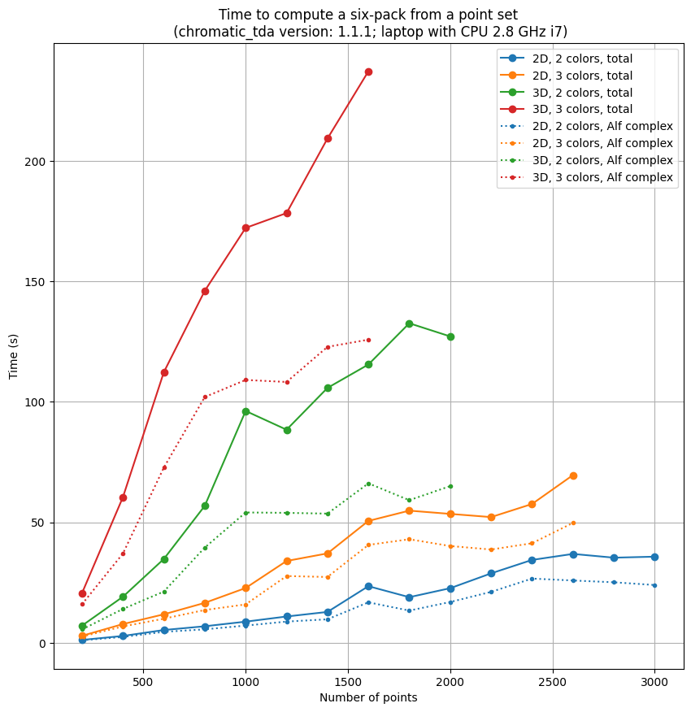
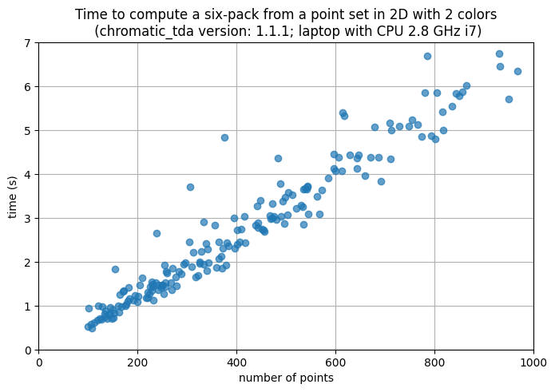

# chromatic_tda

`chromatic_tda` is a package for computing six-packs of persistent diagrams of colored point clouds, such as cells on a tissue slide with an information about their type; or 3D stucture of a material composed of different atoms. The six-pack is a topological summary of capturing many aspects of how the different types of points mingle. It consists of kernel, domain, image, codomain, cokernel and relative persistence diagrams.

The main purpose of the code is to provide implementation to experiment with chromatic topological data analysis. Although not completely naive, many aspects of the code can be optimised, especially if only part of the infomration from the six-packs turns out to be interesting in a given application.

The code gives no restriction on the dimension of points or number of colors, but the complexity quickly grows in both parameters. The expected use is points in 2D or 3D with 2 or 3 colors for hundreds to a few thousand points, but both can be increased for toy examples with small numbers of points.

# Installation

## Install with `pip`

The package is uploaded to [PyPI](https://pypi.org/project/chromatic-tda/), so it can be installed with `pip`.

Run `pip install chromatic_tda`.

## Install from a file from [github project](https://github.com/OnDraganov/chromatic-tda)

From the `dist` folder of the project, you can download the file `chromatic_tda-<version>.tar.gz`, and install it using `pip` as `pip install <path to the file>`.

## Install from [github project](https://github.com/OnDraganov/chromatic-tda)

The project uses `poetry` for Python dependecy management, which allows you to easily install all you need to run the package:

- Clone the repository
- Install `poetry`
- Go to the repository folder in terminal
- Run `poetry shell`
- Run `poetry install`
- [optional] Run `poetry run pytest` to check that the code runs correctly

# How to use

The basic use of the package is as follows:
```
import chromatic_tda as chro
points, labels = ... # load points, labels
chro_alpha = chro.ChromaticAlphaComplex(points, labels) simplicial_complex = chro_alpha.get_simplicial_complex(
             sub_complex=‘bi-chromatic’
             full_complex=‘all’
             relative=‘mono-chromatic’
)  # these options make sense for three colors; for two use, e.g., just sub_complex='mono-chromatic'
six_pack = simplicial_complex.bars_six_pack()
chro.plot_six_pack(six_pack)
```

For more details check the docstrings of the methods and the jupyter notebook file `manual` (in [github repo](https://github.com/OnDraganov/chromatic-tda)). For more background on the theory, check the resources listed below.


# Resources

The code is based on research done at Institute of Science and Technology by Ranita Biswas, Sebastiano Cultrera di Montesano, Ondřej Draganov, Herbert Edelsbrunner and Morteza Saghafian. A preprint of the full paper can be found on arXiv: [Chromatic Alpha Complexes](https://arxiv.org/abs/2212.03128). A shorter introduction to the main ideas can be found in a preprint [Chromatic Topological Data Analysis](https://arxiv.org/abs/2406.04102).

A presentation about the main concepts used in this package can be viewed on YouTube: [AATRN Online Seminar: TDA for Chromatic Point Clouds](https://youtu.be/HIqiF00yKaw). A recording of a complementary talk focusing more on the motivations of the work and the combinatorial structures underlying it is accessible through [google drive](https://drive.google.com/file/d/1RBiGlgY4mlRL59eAVmMLrgBCZYN97QnZ/view).

# Contact

If you have any questions to the code, do not hesitate to contat us. We are also eager to hear from you if you try the code out, and happy to chat about how you can use it on your data. Use, e.g., the mail in my [github profile](https://github.com/OnDraganov).

# Timing

For a rough idea on the performance, see the two plots below showing times the code took on my laptop.


# License

Copyright ©2023. Institute of Science and Technology Austria (IST Austria). All Rights Reserved.  

This file is part of chromatic_tda, which is free software: you can redistribute it and/or modify it under the terms of the GNU Affero General Public License as published by the Free Software Foundation, either version 3 of the License, or any later version.
 
This program is distributed in the hope that it will be useful, but WITHOUT ANY WARRANTY; without even the implied warranty of MERCHANTABILITY or FITNESS FOR A PARTICULAR PURPOSE. See the GNU Affero General Public License for more details.
 
You should have received a copy of the GNU Affero General Public License along with this program. If not, see <https://www.gnu.org/licenses/>.
 
Contact the Technology Transfer Office, ISTA, Am Campus 1, A-3400 Klosterneuburg, Austria, +43-(0)2243 9000, twist@ist.ac.at, for commercial licensing opportunities.
